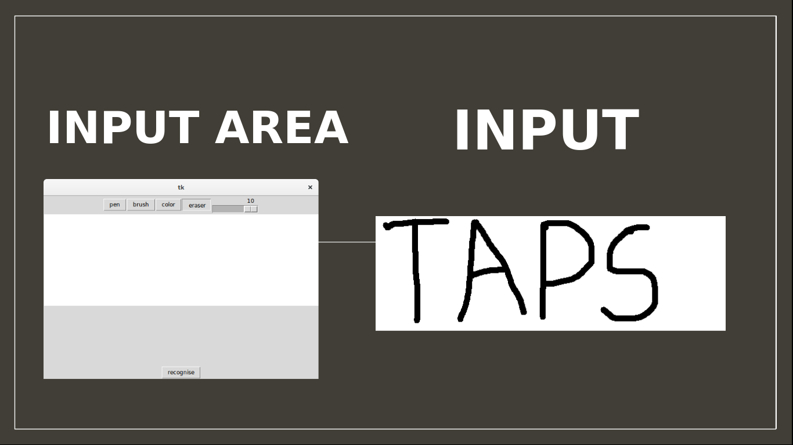
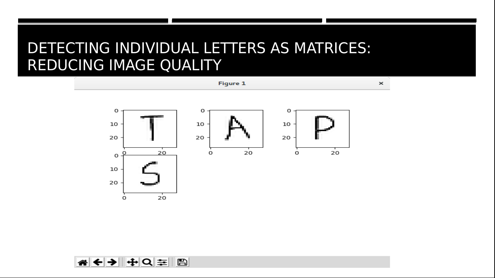
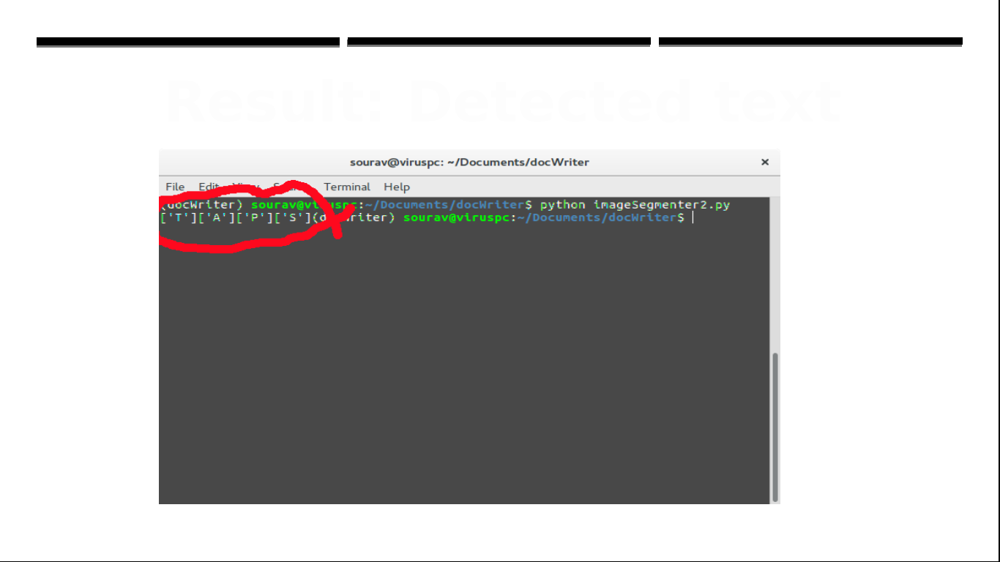

# DocWriter:
## A project to recognize handwriting

What is Handwriting Recognition?

Handwriting recognition (or HWR) is the ability of a computer to receive and interpret intelligible handwritten input from sources such as paper documents, photographs, touch-screens and other devices. 
Handwriting recognition principally entails optical character recognition. However, a complete handwriting recognition system also handles formatting, performs correct segmentation into characters and finds the most plausible words.

## Screenshots

##How to install the requirements
1. First run the virtual environment by `source bin/activate`
2. Then run `pip install -r requirements.txt`
3. To deactivate virtual environment `deactivate`
